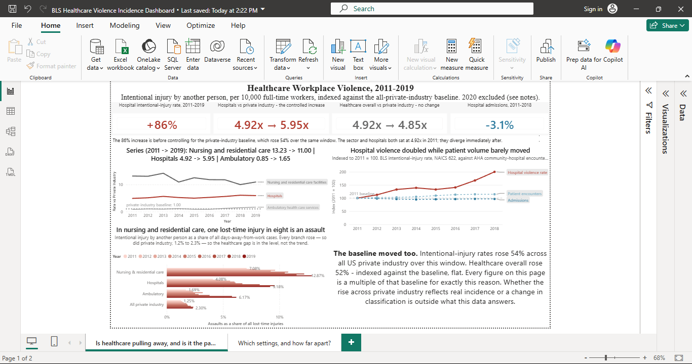
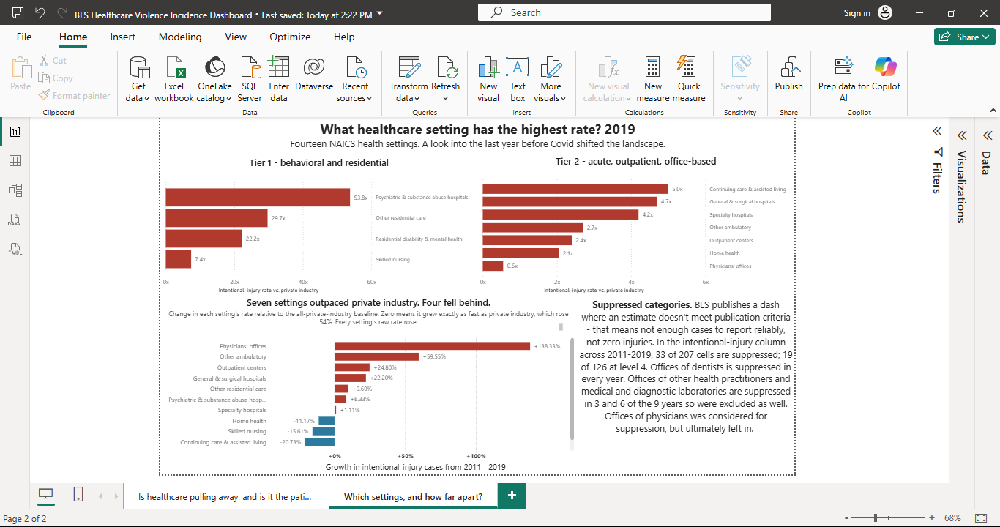

# Healthcare Workplace Violence — US, 2011–2020

**Analysis window: 2011–2019.** 2020 is in the data model but excluded from every trend visual; see [Why 2020 is excluded](#why-2020-is-excluded).

> Between 2011 and 2019, US hospitals got measurably safer and measurably more violent at the same time.



---

## About this project

My partner is a nurse in a large hospital system, and for years I've heard her account of what a shift can involve. After 2020 the claim that healthcare had become more dangerous was everywhere, with the pandemic attached as the explanation. I wanted to know whether the problem predated COVID. If it did, the pandemic explanation is incomplete. If it didn't, the alarm is newer than it sounds. I would have taken either answer. I used the BLS Survey of Occupational Injuries and Illnesses because it's the source policymakers and health system leaders are already working from, and I went in willing to find that the concern outruns what the data supports.

Two choices shape everything below. The headline measure is **intentional injury by another person**, not the broader BLS category "violence and other injuries by persons or animals," which mixes in animal and insect injuries and unintentional contact. And every rate is expressed as a multiple of the all-private-industry benchmark, because the benchmark moved. Intentional-injury rates rose 54% across all US private industry between 2011 and 2019. That was the thing I hadn't accounted for going in. Healthcare's raw numbers were rising against a floor that was rising nearly as fast.

Once the baseline is controlled for, the sector-level answer is no. Health care and social assistance is essentially flat in relative terms across the decade, and nursing care facilities moved down. The support for the alarm sits one level deeper: hospitals rose 86% against that 54% floor, leaving roughly 21% that belongs to hospitals and not to private industry as a whole. The argument this dashboard makes is that the subsector is the right unit of analysis, and the sector is not.

**Stack:** Power BI · Power Query (M) · DAX
**Author:** Aaron Barnett — [github.com/aaron-f-barnett](https://github.com/aaron-f-barnett)

---

## The questions this dashboard answers

### 1. Is healthcare pulling away from the rest of the private sector?

**The measure:** intentional-injury rate per 10,000 FTE, expressed as a multiple of the all-private-industry benchmark row that BLS publishes for each year.

**Why a ratio and not a raw rate:** the private-sector baseline rose from 1.3 to 2.0 per 10,000 FTE between 2011 and 2019, a 54% increase across all US private industry. Healthcare's raw numbers rose against a moving floor, so any un-normalized trend chart overstates what is specific to healthcare.

**What the ratio shows:**

| | 2011 | 2019 | Change |
|---|---|---|---|
| Health care and social assistance | 4.92x | 4.85x | **−1%** |
| Hospitals | 4.92x | 5.95x | +21% |
| General medical and surgical hospitals | 3.85x | 4.70x | +22% |
| Psychiatric and substance abuse hospitals | 49.62x | 53.75x | +8% |
| Nursing and residential care facilities | 13.23x | 11.00x | **−17%** |
| Nursing care facilities (skilled nursing) | 8.77x | 7.40x | **−16%** |
| Ambulatory health care services | 0.85x | 1.65x | +94% |

The sector-wide answer is no. Health care and social assistance rose 52% on the raw rate while the private sector rose 54%. Indexed against the baseline, it is flat. Nursing and residential care moved the opposite direction.

Hospitals are the exception, and the exception is the finding. Hospitals rose 86% raw against a 54% floor, leaving roughly 21% that is specific to hospitals and not shared with private industry.

**Visual:** line chart, `Rate vs Private Industry` on the Y axis, Year on X, Industry on legend. Constant reference line at 1.0x.

Nursing and residential care is the most dangerous branch in the sector for the entire window, and it isn't close. In 2019 it sits at 11.00x the all-private-industry rate, nearly double hospitals at 5.95x. Three of the four highest-rate settings in the data are inside it: other residential care facilities at 29.7x, residential facilities for intellectual and developmental disability and mental health at 22.2x, skilled nursing at 7.4x. Only psychiatric and substance abuse hospitals rank above them, at 53.8x.

What changed is direction, not standing. Against the baseline the branch fell 17% over the window, 13.23x to 11.00x, while hospitals rose 21%, 4.92x to 5.95x. That decline is relative and only relative. Every one of the eleven settings charted had a rising raw rate over these years, skilled nursing among them at +29.8%. It fell against a private-industry baseline that rose 54%. Nursing and residential care did not get safer; it stopped outpacing everyone else, and hospitals started to.

Ambulatory health care services posts the largest relative move in the table, +94%, and it is the one I would trust least. It runs 0.85x to 1.65x, from below the private-industry floor to slightly above it, and it is still the lowest-risk branch in the sector. The same trap shows up sharper a level down: offices of physicians has the highest growth on the ranking page, +266.7%, and the lowest 2019 rate on that page, 0.6x. Growth off a small base overstates itself.

The hospital gap peaks at 6.10x in 2018 and closes slightly to 5.95x in 2019. I read that as a valid data point, not a turn. One year against nine doesn't support a claim that the trend reversed, and the window ends before the question could resolve. What follows is a pandemic, which makes the next five years a different analysis and not a continuation of this one. What the decade supports is the rise. What it can't tell me is whether 2019 was the start of something.

#### Is this a change in recordkeeping?

The strongest objection to everything above is that injury *reporting* changed rather than injury itself. The private-industry baseline cannot answer it. A reporting shift would have lifted the baseline too, so controlling against it proves nothing about recordkeeping.

Hospitals answer it directly.

| Hospitals (NAICS 622), per 10,000 FTE | 2011 | 2019 | Change |
|---|---|---|---|
| Total days-away-from-work rate | 156.7 | 129.7 | **−17%** |
| Intentional injury by another person | 6.4 | 11.9 | **+86%** |
| Violence as a share of all days-away cases | 4.1% | 9.2% | **+5.1 pp** |

Total lost-time injury fell 17% over the window while assaults by another person rose 86%. Same workers, same nine years, same reporting system, opposite directions. Whatever drove the overall rate down did not touch violence. A loosening of injury recordkeeping would have moved both.

By 2019 roughly one lost-time injury in eleven at a hospital was an assault, up from one in twenty-four. In nursing and residential care it was one in eight, up from one in fourteen. The private-industry share rose too, 1.25% to 2.30%, so the direction is not healthcare-specific. The level is.

**Visual:** clustered bar, intentional injury as a share of all days-away cases, three healthcare branches plus the all-private-industry benchmark, 2011–2019.

---

### 2. Which settings carry the most risk, and by how much?

**The measure:** intentional-injury rate per 10,000 FTE, NAICS level 4 only, so no category contains another.

2019, ranked:

| Setting | Rate | vs private industry |
|---|---|---|
| Psychiatric and substance abuse hospitals | 107.5 | 53.8x |
| Other residential care facilities | 59.4 | 29.7x |
| Residential IDD / mental health / substance abuse facilities | 44.4 | 22.2x |
| Nursing care facilities (skilled nursing) | 14.8 | 7.4x |
| Offices of other health practitioners † | 10.5 | 5.3x |
| Continuing care retirement / assisted living | 10.0 | 5.0x |
| General medical and surgical hospitals | 9.4 | 4.7x |
| Specialty hospitals | 8.4 | 4.2x |
| Other ambulatory health care services | 5.4 | 2.7x |
| Outpatient care centers | 4.8 | 2.4x |
| Home health care services | 4.1 | 2.1x |
| Offices of physicians | 1.1 | 0.6x |
| Offices of dentists | *suppressed* | — |
| Medical and diagnostic laboratories † | *suppressed* | — |

The dashboard plots the ratio column; the rate column is carried here because the 98x spread is clearest in raw units. The all-private-industry benchmark is 2.0 per 10,000 FTE in 2019.

† Excluded from the charts. Offices of other health practitioners is suppressed in 3 of 9 years and medical and diagnostic laboratories in 6, so neither supports a continuous series. Eleven of fourteen settings are charted.

**Visual:** two ranked horizontal bar charts, split by care model instead of rank. Tier 1 is behavioral and residential, tier 2 acute, outpatient, and office-based. A single linear axis is illegible below about 5x against a 53.8x maximum; a log scale fixes that and costs most readers the ability to compare magnitudes. The tiers are meaningful categories and not an arbitrary split at the median, so the break itself carries information.

A third chart plots each setting's change in ratio between 2011 and 2019. Zero on it means a setting grew at exactly the pace of the private-industry baseline.

`NAICS Level = 4` as a page filter, Year on a single-select slicer.

The spread is 98x — psychiatric and substance abuse hospitals at 107.5 per 10,000 full-time workers against offices of physicians at 1.1. The more useful fact is that the fourteen settings don't distribute evenly across it. Everything above 20x the private-industry rate is psychiatric, behavioral, or residential. Everything below 6x is outpatient or office-based. The only thing in the middle is skilled nursing at 7.4x. That isn't a gradient. It's two populations with a gap between them.

Risk doesn't track being a healthcare worker. It tracks sustained contact with patients who are cognitively or behaviorally impaired, in a setting the worker can't step out of. A psychiatric nurse and a dental hygienist are both healthcare workers, and their exposure differs by two orders of magnitude. Any policy written for "healthcare workers" is written for a population whose risk varies about a hundredfold, which argues for targeting instead of sector-wide measures.

Growth runs opposite to level, and both of the obvious explanations are partly right. Offices of physicians posts +138% relative growth off 0.23x in 2011. Almost any movement off a base that small produces a large percentage. At the other end, the settings that were already worst had the least room to move; you cannot easily add to 49.62x. So the ordering on the growth chart is partly measuring where each setting started, and I'd rather say that than let the top bar carry more weight than it has earned.

What survives that caveat is the part that matters. Psychiatric hospitals and other residential care still gained on the baseline, +8.33% and +9.69%, from 49.62x and 27.08x. Gaining ground from there, against a baseline that itself rose 54%, is a harder thing to do than moving from 0.23x to 0.55x. The chart's ordering hides it.

Three of the fourteen settings never appear. Offices of dentists is suppressed in all nine years; offices of other health practitioners and medical and diagnostic laboratories are suppressed in three and six years, so I excluded them instead of plotting a broken series. Suppression is not absence. A BLS dash means the estimate did not meet publication criteria. It concentrates in small, low-rate categories, which means the bottom of this ranking is also its least measurable part. Offices of dentists may not be the safest setting in healthcare. It may be the one where too few cases occur to publish.

---

### 3. Is rising violence just rising patient volume?

**The measure:** AHA community-hospital admissions and outpatient visits, year-over-year percent change, against hospital intentional-injury rate, year-over-year percent change. Growth against growth, never rates divided by visits.

Hospital intentional-injury rate, YoY: +12.5% (2012), +18.1% (2013), +4.7% (2014), −4.5% (2015), +5.9% (2016), +18.9% (2017), +19.6% (2018), −7.0% (2019).

Community-hospital encounters, year over year: +2.6% (2012), +0.3% (2013), +2.2% (2014), +4.2% (2015), +3.4% (2016), +1.2% (2017), +0.03% (2018). Outpatient visits are not published in freely available AHA materials after 2018, so admissions alone carry 2019, at −0.5%.

Across 2011–2018, admissions fell 3.1% while total encounters rose 14.6%. The patient load did not shrink; it moved outpatient.

**Visual:** dual-line, both series indexed to 2011 = 100, shared axis.

Patient volume was the first counter-argument I went looking for. If hospitals were simply seeing more people, a rising per-worker injury rate could follow without anything about the work itself having changed. The AHA Annual Survey is the standard source for utilization, so that is what I compared against.

The two series do not share a window. AHA outpatient visits are not published in freely available materials after 2018, so total encounters stop there while the BLS rates run to 2019, and the admissions KPI card is labeled 2011–2018 for that reason. I've left the mismatch visible instead of trimming everything back to 2018. Eight years is enough to establish whether utilization was growing at a pace that could account for the violence trend, and one missing year at the end doesn't change the shape of it. That is the same standard I applied to the 2018–2019 hospital dip: one year is not a trend in either direction.

Over the matched window, total encounters rose 14.6% while the hospital intentional-injury rate rose 100%. Admissions fell 3.1%. The fastest single year for encounter growth was 2015, at +4.2%; the fastest years for violence were 2017 and 2018, at +18.9% and +19.6%. Volume was not moving quickly enough to account for the gap, and on the inpatient side it was moving the other way.

What this does not establish is that volume is irrelevant, and it is the place in the project where I am most likely to overclaim, so I will mark the line myself. BLS rates are normalized per hours worked, which controls for staffing, not for patient load. If the same census were covered by fewer worked hours, meaning more patients per staff-hour, that would appear as a higher per-FTE rate, and it would look exactly like what I am attributing to something else. Encounters per staff-hour is the variable sitting between these two series, and it is not in this dataset. The supportable claim is narrow: raw volume growth alone does not account for the gap. Volume may still play some part.

---

## Why 2020 is excluded

2020 is loaded in the model and filtered out of every trend visual at the visual level, flagged by an `Include in trend` column rather than deleted.

BLS total case rates for 2020 include work-acquired COVID-19 illness. Nursing care facilities went from 180.0 to 1,190.9 per 10,000 FTE in one year; hospitals from 129.7 to 371.7 (+187%). Those are illness cases, not injuries.

Violence rates are less affected but not clean: incidence rates are calculated per hours worked, and 2020 hours worked moved sharply in both directions across healthcare settings, so the denominator is unstable independent of the numerator.

A separate dashboard covers the COVID and post-COVID shift on its own terms.

---

## Data sources

| Source | Provides | Years |
|---|---|---|
| BLS Survey of Occupational Injuries and Illnesses, Table R8 | Days-away-from-work incidence rates per 10,000 FTE by industry and event | 2011–2020 |
| AHA Annual Survey (TrendWatch Chartbook 2020; Fast Facts 2021/2022) | Community-hospital admissions and outpatient visits | 2011–2020 (outpatient through 2018) |

BLS calculates rates as (N ÷ EH) × 20,000,000: cases per 20 million hours worked, equivalent to per 10,000 full-time workers per year.

AHA figures for 2011–2018 come from TrendWatch Chartbook 2020, Appendix Table 3.1; 2019 and 2020 admissions come from Fast Facts 2021 and 2022. Both report community hospitals from the AHA Annual Survey, but they are separate publications, so the 2018–2019 step joins two publications instead of continuing one series. Emergency department visits are excluded on purpose: AHA counts non-admitted ED patients as outpatient visits and admitted ED patients as admissions, so admissions plus outpatient visits is already a complete, non-overlapping count.

2021–2024 excluded by design: continued COVID distortion and dual-year table formats.

---

## Data preparation

Ten annual BLS vintages appended into one 23-category series per year: sector row, ambulatory / hospitals / nursing branches, and the all-private-industry benchmark.

**NAICS codes are not stable across the source files.** BLS switched from variable-length codes to zero-padded six-digit codes at 2017: `622` becomes `622000` and `6211` becomes `621100`, while the two-digit sector code is left alone. Grouping on the raw code splits every industry into two entities with a gap at 2016.

Harmonization, in order, as steps appended to the combined query:

1. NAICS cast to text, so Power BI cannot aggregate it
2. Hierarchy level derived **before** padding, as the length of the code with trailing zeros stripped, one rule that resolves both code formats identically, since no pre-2017 code ends in a zero
3. Codes right-padded to six characters, producing a key stable across all ten years
4. Level number mapped to a readable label for slicers

I verified that level counts are identical in all ten years (1 benchmark, 1 sector, 3 subsectors, 14 industry groups, 2 NAICS industries, 2 national industries) and that no industry resolves to more than one padded key.

**Suppressed values are nulls, not zeros.** BLS publishes a dash where a cell does not meet publication criteria. In the intentional-injury column across 2011–2019, 33 of 207 cells are suppressed; at level 4, 19 of 126. Offices of dentists is suppressed in every year and never renders. Suppression is preserved, never filled, and visuals show the gap instead of silently dropping the category.

**How the years were assembled.** BLS publishes Table R8 as a spreadsheet from 2016 forward. For 2011–2015 it exists only as a PDF. Totals and NAICS codes came out of the PDF text layer; the event and exposure columns do not survive extraction, so I captured each page as an image and typed those by hand into a per-year workbook. Twenty-three industry rows a year, five years. Two column groups this analysis does not use, contact with objects and falls/slips/trips, were left untranscribed for those years, which is why the 2011–2015 files carry a narrower column set than 2016 onward.

**How I checked it.** Two passes over the transcription: I re-read every row against the source image after entry, then ran a second comparison of each finished sheet against the same images to catch what reading back had missed.

Then I tested the data against itself. Table R8 publishes the "violence and other injuries by persons or animals" total alongside its three components, so the components should sum to the total. In 26 of the 117 rows where all four values are published, they don't, and every difference runs the same direction, with the total exceeding the sum. The failures appear in the machine-readable years as well as the transcribed ones. 2012 Other residential care facilities publishes a total of 83.5 against components summing to 81.5, and the source page prints it that way.

So the violence total carries a residual sub-event that R8 does not break out. That is a property of the source and not of my transcription, and it is why every measure in this project reads the intentional-injury column directly instead of deriving anything from the broad total, which would have inherited an unexplained remainder.

**Nothing is imputed.** Suppressed cells stay null. No value is filled from another vintage, another table, or an interpolation.

The full cleaning trail is in [`docs/DATA_CLEANING.md`](docs/DATA_CLEANING.md), and every category rename with the argument for it is in [`docs/RENAMING_LOG.md`](docs/RENAMING_LOG.md).

---

## Model and measures

SOII fact table with a `DimYear` dimension relating to it and to the AHA utilization table, single direction, so one year slicer drives both series. Guarded lookups rather than aggregations, because the source is already aggregated: BLS's level-3 "Hospitals" row *is* the correctly weighted roll-up of its level-4 children, and the extract carries rates without the hours-worked denominator needed to recompute one. Measures select the right pre-computed row; they never sum or average across rows.

```dax
Intentional Rate =
IF (
    AND ( HASONEVALUE ( SOII[NAICS code] ), HASONEVALUE ( SOII[Year] ) ),
    SELECTEDVALUE ( SOII[Intentional injury by other person] ),
    BLANK ()
)
```

```dax
Baseline Rate =
VAR CurrentYears = VALUES ( SOII[Year] )
RETURN
IF (
    HASONEVALUE ( SOII[Year] ),
    CALCULATE (
        SELECTEDVALUE ( SOII[Intentional injury by other person] ),
        REMOVEFILTERS ( SOII ),
        CurrentYears,
        SOII[NAICS Level] = 0
    ),
    BLANK ()
)
```

`REMOVEFILTERS` targets the whole table because Industry, NAICS code, NAICS Level, and NAICS Level Name all constrain to the same row; clearing one leaves the others blocking the benchmark row. Year is captured first and re-applied, or the benchmark spans the full decade.

```dax
Rate vs Private Industry = DIVIDE ( [Intentional Rate], [Baseline Rate] )

Intentional Rate LY =
VAR y = SELECTEDVALUE ( SOII[Year] )
RETURN CALCULATE ( [Intentional Rate], SOII[Year] = y - 1 )

Rate vs Private Industry Change =
    [Rate vs Private Industry] - [Rate vs Private Industry LY]
```

`DimYear[Year]` is stored as a whole number so `y - 1` resolves; the axis is set to categorical instead of converting the column to text. Every visual axis and slicer binds `DimYear[Year]` rather than the fact-table column.

**I built this wrong first.** The original `Intentional Rate` was an AVERAGE over the rows in context. That returns the correct answer whenever exactly one row is in context, which is most of the time, so the fault hides. It surfaces on totals and on any unfiltered card: averaging the three hospital sub-types returns 41.8 for 2019 against BLS's published 11.9 for Hospitals.

The reason is that these rates are already weighted. BLS computes each one per hours worked, so the Hospitals row reflects the fact that general medical and surgical hospitals employ far more people than psychiatric hospitals do. An unweighted average discards that and lets psychiatric hospitals' 107.5 pull as hard as general medical's 9.4. The extract carries rates without the hours-worked denominator, so a correct roll-up cannot be recomputed from the children at all. The only correct move is to read the parent row BLS already published, which is what every measure here does.

**On clearing filters.** Base-year and benchmark measures clear the year dimension rather than the fact table. `REMOVEFILTERS ( DimYear )` releases only the year; `REMOVEFILTERS ( SOII )` also releases Industry, NAICS code, NAICS Level and NAICS Level Name, which are exactly what the guarded lookups depend on. Clearing them makes `HASONEVALUE` false and the measure returns blank at every point on the axis.

I lost real time to that. An indexed hospital measure came back empty across the whole axis, and the debug measure I wrote to diagnose it used the same blunt wipe, so it could not see the fault it was written to find. Two wrong diagnoses later, Model view settled it. The rule I would give anyone reading this: name the columns you mean to clear, and only reach for the whole-table wipe when you are deliberately jumping to the benchmark row, as `Baseline Rate` does above.

**Measures beyond the five shown.** `DAFW Rate` is the same guarded lookup against the total days-away column. `Violence Share of DAFW` divides the intentional rate by it. `Violence Share 2011` and `Violence Share 2019` pin that share to an endpoint via `REMOVEFILTERS ( DimYear )`, and their difference gives the change in percentage points. The page-2 growth chart uses the equivalent pair against `Rate vs Private Industry`.

---

## Key findings

**Hospitals got safer and more violent at the same time.** The total days-away-from-work rate fell 17% between 2011 and 2019 while intentional injury by another person rose 86%. Same workers, same nine years, same reporting system.

**The sector-level alarm does not survive the control.** Intentional-injury rates rose 54% across all US private industry over the same window. Measured against that baseline, health care and social assistance is flat. Hospitals retain roughly 21%.

**Nursing and residential care is the most dangerous branch in the sector, and the only one that lost ground against the baseline**: 11.00x the all-private-industry rate in 2019, down from 13.23x in 2011. The series is noisy, peaking at 14.27x in 2013, but the second half of the window averages about 13% below the first. Its raw rate still rose. It rose more slowly than the private-industry floor beneath it.

**A 98x spread separates psychiatric hospitals from physicians' offices inside a single sector**, and the settings cluster into two groups rather than spreading evenly across that range. Everything above 20x is behavioral or residential; everything below 6x is outpatient or office-based.

**Violence is taking a growing share of all workplace harm, private industry included**: 1.25% of days-away cases in 2011, 2.30% in 2019. Healthcare's difference is the level, not the direction.

---

## Limitations

**The private-industry-wide rise is unexplained.** Intentional-injury rates rose 54% across all US private industry between 2011 and 2019. Whether that reflects a real increase or a change in how such injuries are classified and recorded is outside what this data can answer, and it conditions every comparison above.

**Rates are per hours worked, not per person.** Settings with heavy part-time staffing understate the share of individual workers affected.

**Per-FTE does not control for patient volume.** It controls for staff hours. Encounters per staff-hour is the variable between the two series in Question 3 and is not in this dataset.

**Suppression is not absence.** A BLS dash means the estimate did not meet publication criteria, not that no injuries occurred. Suppression is concentrated in small categories, which biases the low end of the ranking in Question 2.

**Universes overlap but do not match.** AHA "community hospitals" and BLS NAICS 622 are not the same population.

**2020 total-injury rates include work-acquired COVID-19 illness.**

**Unintentional and unknown-intent injuries are excluded by choice.** BLS splits "violence and other injuries by persons or animals" into intentional injury by another person, injury by person with unintentional or unknown intent, and animal and insect related. I use only the first. The middle category plausibly contains real assaults that were never classified as such, so this measure is conservative rather than complete. It is also the only one of the three that unambiguously describes what I set out to study.

**What would change the conclusion.** If staffing data showed hours worked per patient encounter falling sharply across this window, the volume explanation comes back into play. A thinner staffing ratio raises the per-FTE rate without violence itself becoming more frequent. BLS computes each rate as (N ÷ EH) × 20,000,000, so with the hours-worked figure in hand the case counts could be recovered and re-expressed per patient encounter rather than per hour worked. That is the test I would run. It is not possible from the published tables alone: R8 gives the rate and withholds the denominator.

---

## What I'd do next

**Recover the hours-worked denominator.** BLS publishes employment and hours data outside Table R8. With it, the rates here could be converted back to case counts and re-normalized per patient encounter. That is the one control this analysis is missing.

**Break the composition shift down by subsector.** Violence went from 4.1% to 9.2% of hospital days-away cases over nine years. Whether that tracks any change in policy, staffing model, patient mix, or reporting practice is a question this data raises and cannot answer.

**Run 2020–2024 as its own analysis.** Not an extension of this one. COVID contaminates the total-case denominator, hours worked move sharply in both directions, and BLS switches to dual-year tables. Each needs handling on its own terms instead of being trended through.

---

## Repo structure

```
README.md                                  this document
BLS Healthcare Violence Incidence Dashboard.pbix
bls-violence-theme.json                    report theme
images/                                    page screenshots
data/
  R8_2011_to_2020_CLEAN.xlsx               combined series, 2011-2015
  BLS_R8_2011_Healthcare_CLEAN.xlsx        ... through 2020, one file per vintage
docs/
  DATA_CLEANING.md                         file structure, column sets, scope
  RENAMING_LOG.md                          every category rename and its justification
```

The raw BLS source documents are not republished here. Table R8 is available from the BLS Survey of Occupational Injuries and Illnesses for every year in this window, and the cleaned files above record exactly what was taken from each one. AHA utilization figures are cited to their publication and page in [Data sources](#data-sources).
