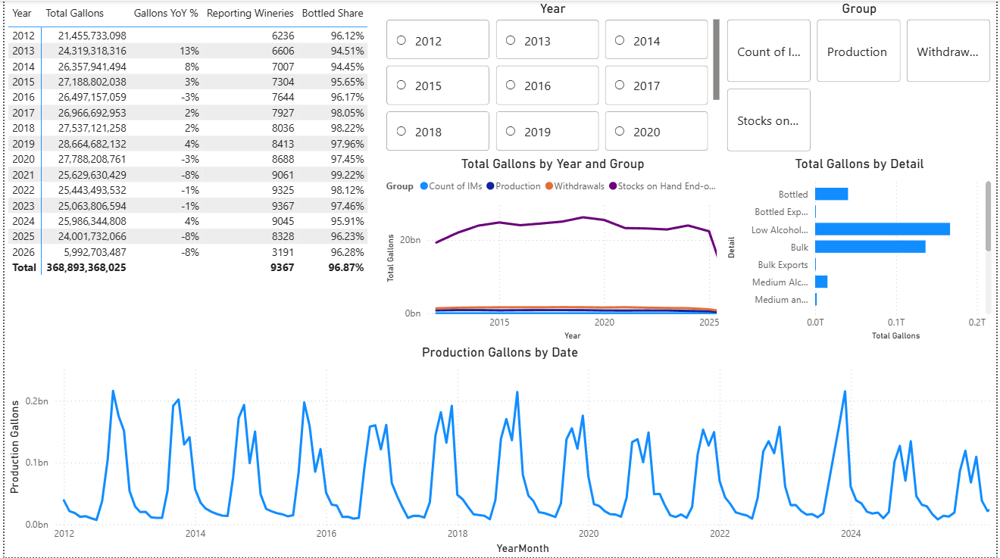

# US Wine Industry Monitor - Power BI Dashboard tracking TTB data (2012-2025)

## Problem Framing: 

This dashboard monitors US wine production, winery counts, and seasonal ramp-up using TTB data. Dashboard shows the historical shifts in production, broken down by category, of the US wine production for the past 14 years. 

## Data:

 I pulled the data from https://www.ttb.gov/regulated-commodities/beverage-alcohol/wine/wine-statistics and derived all calculated measures from it. It covers from 2012-2025, wineries self report via TTB form 5120.17, and TTB organizes the release to reflect the sections within the form. TTB suppresses values (and reporting counts) in sparse categories where publishing would reveal an individual filer's confidential figures.  Monthly national data, one row per statistical group / category / detail combination (e.g., one row = gallons of bottled taxable withdrawals for March 2019). ~4,600 rows after removing subtotals.

## Decisions & Explanations:

* Redacted rows: I kept the redacted rows due to their minimal impact (3%) on the data. The redacted flags are themselves imformative - they indicate categories sparse enough to indicate individual filers.
* Category Total Removed: TTB includes subtotal rows ('0-Category Total') alongside the detail rows they summarize, so any SUM double-counts; I excluded them (~4,600 rows remain).
* Number of Wineries: I used TTB's published "Count of IMs" total rather than summing category counts. 
* Filter Out 2026: Incomplete year, would skew results.
* Bottled Share: Edited formula to account for the detail "Bottled" existing in both "Taxable Withdrawals" and "Stocks on Hand" categories. 
* Series-Break: TTB's detail definitions changed mid-series (e.g., alcohol-class breakdowns shifting around the 2018 tax-class change from 14% to 16%), so long-run trends on any single detail value cross a definition boundary.

## What I'd Do Next:

* Update the dashboard to be represented by complete years natively rather than as a visual filter.
* Examine if a trend or relationship exists in the timing of "Bulk" loss each year and how that has changed since 2012.
* Create a similar dashboard per state.

## Insight:

The industry has discussed the decline in wine production over the past couple of years and that can be seen in the data presented. Measured from 2020, the first negative year after 2019's peak, to 2025, there was negative growth YOY (excluding 2024). Even with the small growth in 2024, there has been a 13.6% decrease in Total Gallons from 2020 to 2025.   

Report file: [wine-industry-monitor.pbix](wine-industry-monitor.pbix)
Built in Power BI Desktop (Power Query, DAX). Data model: single fact table + DAX-generated date table.